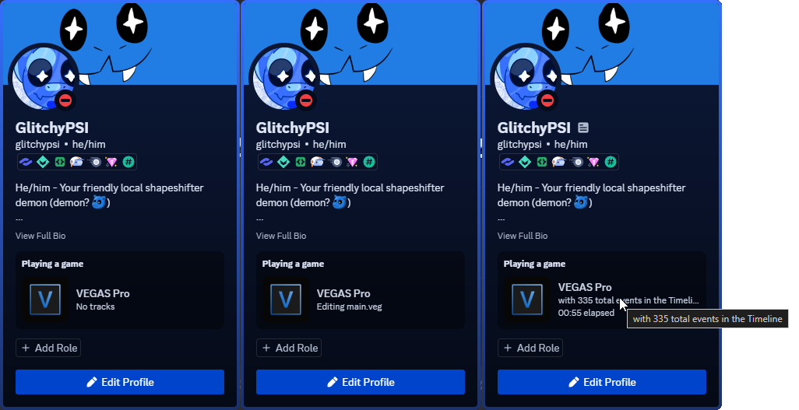

# VEGAS Pro Rich Presence for Discord

Because why not? There wasn't any before.

## Overview

This is an extension for VEGAS Pro from MAGIX VEGAS 14 up to VEGAS 21 (downloadable from MAGIX's website) that enables support for Discord's Rich Presence features.

## Features

 * Display how many tracks of both Audio and Video you're currently editing.
   * Display how many events (audio/video/adjustment) are in your Timeline
   * Display your project's name

 * Displays whether you're rendering, and how much time has passed since you started, whether you cancelled, failed, or finished successfully.
   * Displays how much time you've spent since the project was opened

 * Displays when you're just being lazy (300 seconds of inactivity, configurable)

 * Displays a logo related to your VEGAS version as well as its specific version on hover.

## Roadmap

 - [x] Basic functionality stated above
 - [x] Able to turn on and off the Rich Presence
 - [ ] Change the old discord-rpc.dll with the new Game SDK library
 - [ ] Small key icons for when you're recording, etc...
 - [ ] Compatibility with Sony Vegas (Vegas Pro 12 and lower)

## Requirements

 * MAGIX (not Sony) VEGAS Pro 14 and above (64-bit)
   * This does **NOT** work in Movie Studio!
 * .NET Framework 4.8

## Install Instructions

Grab the latest `"VEGASRPC.zip"` from the [Releases tab](https://github.com/GlitchyPSIX/VEGASRPC/releases/latest) and extract its contents in **My Documents/Vegas Application Extensions** or **C:/ProgramData/Vegas Pro/Application Extensions** (Only one of these!).

The folder(s) may or may not already exist. If they don't, create the folder. The easiest one to set up is the one in your Documents folder.

## Building

To build this extension, you need:
 * MAGIX VEGAS Pro 14 or later,
 * Visual Studio 2022
 * .NET Framework 4.8

Drag your MAGIX VEGAS's ``ScriptPortal.Vegas.dll`` into the folder ``Libraries`` inside the "VEGAS4Discord" folder. This is because the library for VEGAS Scripting cannot be distributed.

## License

MIT. See LICENSE for more details.